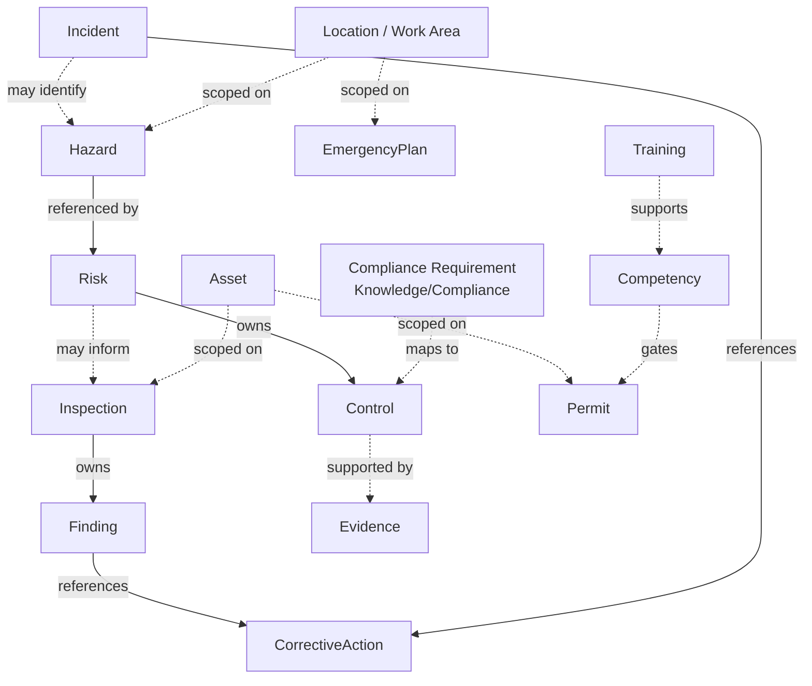
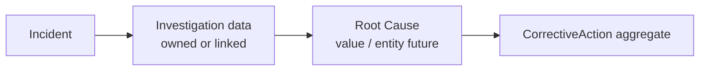

# Safety Domain Aggregates

Status: Active  
Date: 2026-07-24  
Task: TASK-P8-001

Related documents:

- [SafetyDomainFoundation.md](SafetyDomainFoundation.md)
- [UbiquitousLanguage.md](UbiquitousLanguage.md)
- [LifecycleRules.md](LifecycleRules.md)
- [DomainEvents.md](DomainEvents.md)

---

## 1. Design Principles

- Prefer **small aggregates** with clear transactional boundaries.
- Cross-aggregate links are **references by ID**, never owning nested roots.
- No circular ownership between aggregates.
- Every operational aggregate is **organization-owned** unless marked as catalog/reference data.
- Persistence and HTTP DTOs must not appear inside aggregate definitions.

---

## 2. Aggregate Catalog

### 2.1 Hazard

| Aspect | Definition |
|--------|------------|
| **Purpose** | Capture and govern identified sources of potential harm. |
| **Root** | `Hazard` |
| **Owned entities** | Optional hazard notes/history entries (future); classification tags as VOs |
| **Value objects** | `HazardId`, `HazardStatus`, `HazardCategory` |
| **Invariants** | Organization is immutable after creation; archived hazards cannot be reactivated without explicit restore policy (future); title/description required when Active |
| **Lifecycle** | Draft → Active → Archived ([LifecycleRules.md](LifecycleRules.md)) |
| **Transactional boundary** | Create/update status/metadata of one Hazard; linking a Risk is a separate Risk transaction |

### 2.2 Risk (Risk Assessment outcome)

| Aspect | Definition |
|--------|------------|
| **Purpose** | Record evaluation of a Hazard and the controls that treat it. |
| **Root** | `Risk` |
| **Owned entities** | `Control` (ordered by Hierarchy of Controls) |
| **Value objects** | `RiskId`, `RiskLevel`, `Probability`, `Severity`, `ResidualRisk`, `ControlType` |
| **Invariants** | Must reference an existing `HazardId`; residual risk must not exceed inherent unless explicitly justified (future rule); controls belong to exactly one Risk |
| **Lifecycle** | Draft → Assessed → Accepted → Monitoring → Archived |
| **Transactional boundary** | Risk rating changes and Control add/update within the same Risk |

**Note:** “Risk Assessment” is the business process; the persisted aggregate root is `Risk` (assessment outcome for a hazard context). Multi-hazard assessments may appear later as a coordinating aggregate without enlarging `Risk`.

### 2.2a RiskControl

| Aspect | Definition |
|--------|------------|
| **Purpose** | Independently manage operational risk controls through implementation, verification, and review. |
| **Root** | `RiskControl` |
| **Value objects** | `RiskControlId`, `ControlType` (Hierarchy of Controls), `ControlNature`, source/scope/owner/implementation/verification/review VOs |
| **Invariants** | Organization immutable; embedded assessment controls remain historical snapshots; source snapshot immutable after create; no hard delete |
| **Lifecycle** | Draft → Planned → In Implementation → Implemented → Verified Effective (+ ineffective/suspended/superseded/archived/cancelled) |
| **Transactional boundary** | One RiskControl aggregate; does not mutate RiskAssessment residual risk |
| **Docs** | [RiskControl.md](RiskControl.md) |

### 2.3 Inspection

| Aspect | Definition |
|--------|------------|
| **Purpose** | Plan and execute workplace/asset verification and capture Findings. |
| **Root** | `Inspection` |
| **Owned entities** | `Finding` (and optional Observation notes) |
| **Value objects** | `InspectionId`, `InspectionStatus`, `FindingSeverity` |
| **Invariants** | Findings cannot be added after Archived; Completed inspections require completion timestamp; organization immutable |
| **Lifecycle** | Planned → InProgress → Completed → Archived |
| **Transactional boundary** | Inspection header + its Findings in one unit of work |

### 2.4 Incident

| Aspect | Definition |
|--------|------------|
| **Purpose** | Record unplanned events (including Near Miss), response, and investigation linkage. |
| **Root** | `Incident` |
| **Owned entities** | Investigation narrative sections (future), classification (`NearMiss` flag/VO) |
| **Value objects** | `IncidentId`, `IncidentStatus`, severity/classification VOs |
| **Invariants** | Reported time required; Near Miss cannot simultaneously record actual injury severity of “fatal” (future validation); references Corrective Actions by ID |
| **Lifecycle** | Reported → UnderInvestigation → ActionsPending → Closed → Archived |
| **Transactional boundary** | Incident record updates; assigning Corrective Actions creates/updates the **CorrectiveAction** aggregate separately |

### 2.5 CorrectiveAction

| Aspect | Definition |
|--------|------------|
| **Purpose** | Track remediation from Finding/Incident/audit through verification. |
| **Root** | `CorrectiveAction` |
| **Owned entities** | Verification records (future) |
| **Value objects** | `CorrectiveActionId`, action status, due dates as validated VOs |
| **Invariants** | Closed requires Verified (or explicit waive policy later); assignee required when Assigned+ |
| **Lifecycle** | Open → Assigned → InProgress → Completed → Verified → Closed |
| **Transactional boundary** | Single Corrective Action lifecycle; origin references (`FindingId` / `IncidentId`) are IDs only |

Preventive Action may share this aggregate with a `action_kind` VO or become a parallel aggregate in a later task — documented as extension point, not implemented here.

### 2.6 Training

| Aspect | Definition |
|--------|------------|
| **Purpose** | Record training delivery and completion toward Competency. |
| **Root** | `Training` (training record / enrollment outcome) |
| **Owned entities** | Attendance/completion evidence references (future) |
| **Value objects** | `TrainingId`, `TrainingStatus` |
| **Invariants** | Completed requires completion timestamp; person reference required |
| **Lifecycle** | Planned → InProgress → Completed → Expired/Archived |
| **Transactional boundary** | One training record; Competency grant may be a later derived policy |

### 2.7 Permit (Permit To Work)

| Aspect | Definition |
|--------|------------|
| **Purpose** | Authorize high-risk work under controls for a validity window. |
| **Root** | `Permit` |
| **Owned entities** | Isolation/checklist line items (future) |
| **Value objects** | `PermitId`, `PermitStatus` |
| **Invariants** | Issued requires issuer + validity window; Closed cannot reopen without new permit; work location required |
| **Lifecycle** | Draft → Issued → Suspended? → Closed → Archived |
| **Transactional boundary** | Single permit; does not embed full Risk aggregates |

### 2.8 EmergencyPlan

| Aspect | Definition |
|--------|------------|
| **Purpose** | Maintain response arrangements for locations/scenarios. |
| **Root** | `EmergencyPlan` |
| **Owned entities** | Scenario sections, contact lists (future) |
| **Value objects** | `EmergencyPlanId`, `EmergencyLevel` |
| **Invariants** | At least one Location scope; activation is a distinct operational event (future) |
| **Lifecycle** | Draft → Active → UnderReview → Archived |
| **Transactional boundary** | Plan content; drills are separate records/references |

### 2.9 Asset

| Aspect | Definition |
|--------|------------|
| **Purpose** | Identify equipment/plant subject to hazards, inspections, and permits. |
| **Root** | `Asset` |
| **Owned entities** | None initially (attributes as VOs) |
| **Value objects** | `AssetId`, asset category/classification |
| **Invariants** | Organization-owned; identifier unique within organization (future) |
| **Lifecycle** | Active → Inactive → Decommissioned |
| **Transactional boundary** | Asset master data only |

---

## 3. Relationship Map

### Ownership vs reference

Solid bold ownership edges are inside one aggregate transaction. Dashed edges are ID references across aggregates.

### Incident investigation chain

---

## 4. Explicit Non-Ownership Rules

| From | To | Rule |
|------|----|------|
| Risk | Hazard | Reference only; Hazard does not embed Risks |
| Finding | CorrectiveAction | Reference by ID; CA is its own root |
| Permit | Risk | May reference RiskIds; does not own Risk |
| EmergencyPlan | Incident | No ownership; activation may create Incident later |
| Asset | Inspection | Asset does not own Inspections |

---

## 5. Catalog / Reference Data (Non-Aggregates or Shared)

| Concept | Treatment |
|---------|-----------|
| Hierarchy of Controls levels | Immutable catalog VO / enum |
| HazardCategory, PPECategory, ChemicalClassification | Reference enums or future org-configurable catalogs |
| Compliance Requirement | **Outside** Safety domain — Knowledge/Compliance modules |
| SDS content | Knowledge/document evidence; Chemical may reference SDS identity |

---

## 6. Future Aggregates (Out of Scope)

Contractor/Employee/Visitor person masters, Chemical inventory, standalone Observation streams, and Audit program aggregates may be introduced in later tasks without redesigning the roots above.
