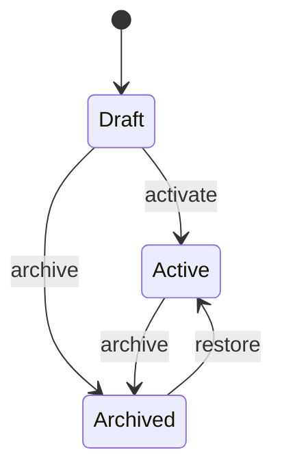

# Hazard Management

Status: Implemented (TASK-P8-002)

## Purpose

Organization-scoped hazard management is the first complete Safety vertical slice:
register, classify, update, activate, archive, restore, search, authorize, and audit hazards.

The aggregate is jurisdiction-neutral. Russian occupational, industrial, fire,
environmental, transport, and dangerous goods practice is supported through
extensible classifications and optional extension references — not by hard-coding
legal conclusions into the core model.

## Aggregate structure

```text
Hazard
├── id
├── organization_id
├── code
├── title
├── description
├── category
├── safety_directions[]
├── source
├── affected_subjects[]
├── location_reference
├── process_reference
├── equipment_reference
├── extension_references{}
├── status
├── identified_at / identified_by
├── reviewed_at / reviewed_by
├── archived_at / archived_by
├── created_at / updated_at
└── version
```

## Lifecycle



Invalid transitions raise domain errors (`HazardAlreadyActive`,
`InvalidHazardTransition`, `HazardNotArchived`, …). Application handlers call
domain methods and do not re-implement transition rules.

## Categories and safety directions

Categories are stable domain codes (`physical`, `chemical`, `dangerous_goods`, …)
and may be extended later without changing the aggregate contract shape.

Safety directions represent business scope areas (occupational, industrial, fire,
environmental, transport, dangerous goods transport, civil defense, sanitary,
electrical, radiation). A hazard may belong to multiple directions.

## Russian safety extension points

`extension_references` stores optional string references for future objects such as:

- Occupational: workplace, SOUT result, PPE/training/medical requirements
- Industrial: OPO, technical device, expertise, production control
- Fire: fire/explosion category, compartment, evacuation requirement
- Environmental: aspect, waste stream, emission/discharge, spill scenario
- Dangerous goods: UN number, class, packing group, tunnel code
- Transport: vehicle, route, pre-trip control

Full aggregates for those concepts are out of scope for TASK-P8-002.

## Tenant ownership

Every read/write is scoped by `organization_id` from `TenantContext`. Cross-tenant
access is masked as `404`. Clients cannot set organization ownership on create.

## Authorization

| Permission | Admin | Member | Auditor |
|---|---|---|---|
| `hazard:read` | yes | yes | yes |
| `hazard:create` | yes | yes | no |
| `hazard:update` | yes | yes | no |
| `hazard:activate` | yes | no | no |
| `hazard:archive` | yes | no | no |
| `hazard:restore` | yes | no | no |

## Audit behavior

Tamper-evident audit events:

- `safety.hazard.created`
- `safety.hazard.updated`
- `safety.hazard.activated`
- `safety.hazard.archived`
- `safety.hazard.restored`

Metadata includes hazard id/code, status transition fields, category, directions,
and reason where applicable. Free-text descriptions are intentionally omitted.

## Archive history limitation

The aggregate stores a single `archived_at` / `archived_by` pair. Restoration does
not erase those markers; repeated archive cycles rely on audit events for full
transition history.

## Future integration

TASK-P8-003 will attach risk assessments to **Active** hazards. Knowledge Engine
and regulatory ingestion remain separate and must not leak into this aggregate.
