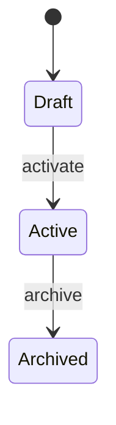
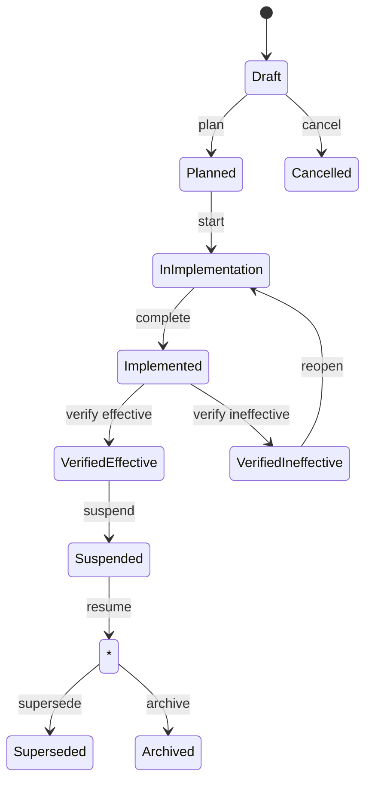
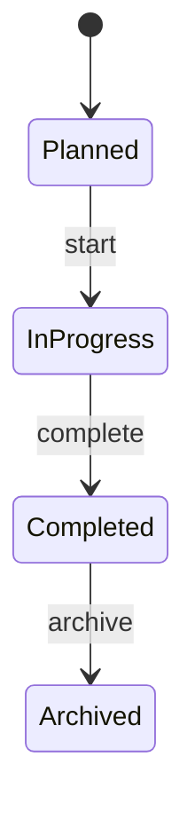
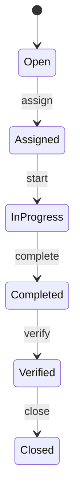

# Safety Domain Lifecycle Rules

Status: Active  
Date: 2026-07-24  
Task: TASK-P8-001

Related documents:

- [Aggregates.md](Aggregates.md)
- [DomainEvents.md](DomainEvents.md)
- [UbiquitousLanguage.md](UbiquitousLanguage.md)

---

## 1. Conventions

- Transitions are enforced in the domain layer (entity methods / domain services).
- Illegal transitions raise domain errors (no silent coercion).
- Each successful transition may raise the domain event listed.
- Timestamps are UTC.

---

## 2. Hazard

| From | To | Validation | Domain event |
|------|----|------------|--------------|
| — | Draft | create | `hazard.created` |
| Draft | Active | required descriptive fields present | `hazard.activated` |
| Active | Archived | optional reason | `hazard.archived` |
| Draft | Archived | allowed for abandoned drafts | `hazard.archived` |

Allowed: Draft → Active, Draft → Archived, Active → Archived, Archived → Active (restore).
Disallowed: Active → Draft; other reverse transitions without explicit restore.

---

## 2a. RiskControl

| From | To | Validation | Domain / audit event |
|------|----|------------|----------------------|
| — | Draft | create with scope/source | `risk_control.created` / `safety.risk_control.created` |
| Draft | Planned | owner, target date, verification method | `risk_control.planned` |
| Planned | In Implementation | — | `risk_control.implementation_started` |
| In Implementation | Implemented | evidence or waiver, summary | `risk_control.implemented` |
| Implemented | Verified Effective | effective result + review decision | `risk_control.verified_effective` |
| Implemented | Verified Ineffective | ineffective result + findings | `risk_control.verified_ineffective` |
| * operational | Suspended | reason | `risk_control.suspended` |
| Suspended | previous | — | `risk_control.resumed` |
| operational | Superseded | replacement id + reason | `risk_control.superseded` |
| non-terminal | Archived | reason | `risk_control.archived` |
| Draft/Planned/… | Cancelled | reason | `risk_control.cancelled` |

Partial effectiveness remains distinguishable and does not enter `Verified Effective`.

Residual risk is **not** rewritten by RiskControl transitions; reassessment may be recommended.

---

## 3. Risk

| From | To | Validation | Domain event |
|------|----|------------|--------------|
| — | Draft | references HazardId | (create) |
| Draft | Assessed | probability + severity (+ inherent level) present | `risk.assessed` |
| Assessed | Accepted | authorized acceptance recorded (app layer) | `risk.accepted` |
| Accepted | Monitoring | optional review date | — |
| Monitoring | Assessed | reassessment | `risk.assessed` |
| * | Archived | not Draft-empty without reason policy | — |

Residual risk is recalculated/recorded on control changes (algorithm later).

---

## 4. Inspection

| From | To | Validation | Domain event |
|------|----|------------|--------------|
| — | Planned | create | — |
| Planned | InProgress | starter identity optional now | — |
| InProgress | Completed | completion time; findings frozen for edit policy later | `inspection.completed` |
| Completed | Archived | — | — |

Disallowed: Completed → InProgress; Planned → Completed (must start).

Finding creation allowed in InProgress (and optionally Completed under amend policy — default: InProgress only).

---

## 5. Finding

Findings are owned entities. Minimal status: Open → Closed (via CorrectiveAction linkage or direct close). Detailed Finding state machines may expand later without changing Inspection’s boundary.

---

## 6. Incident

| From | To | Validation | Domain event |
|------|----|------------|--------------|
| — | Reported | create | `incident.reported` |
| Reported | UnderInvestigation | — | — |
| UnderInvestigation | ActionsPending | — | — |
| ActionsPending | Closed | open CAs policy later | — |
| Closed | Archived | — | — |

Near Miss is a classification on the Incident, not a separate lifecycle.

---

## 7. Corrective Action

| From | To | Validation | Domain event |
|------|----|------------|--------------|
| — | Open | origin reference | — |
| Open | Assigned | assignee required | `corrective_action.assigned` |
| Assigned | InProgress | — | — |
| InProgress | Completed | completion note/evidence ref later | `corrective_action.completed` |
| Completed | Verified | verifier ≠ assignee preferred (policy later) | `corrective_action.verified` |
| Verified | Closed | — | — |

Disallowed: skip Verified to Closed by default; Closed → InProgress.

---

## 8. Training

| From | To | Validation | Domain event |
|------|----|------------|--------------|
| — | Planned | — | — |
| Planned | InProgress | — | — |
| InProgress | Completed | completion time | `training.completed` |
| Completed | Expired | validity elapsed (policy) | — |
| * | Archived | — | — |

---

## 9. Permit

| From | To | Validation | Domain event |
|------|----|------------|--------------|
| — | Draft | — | — |
| Draft | Issued | validity window, issuer | `permit.issued` |
| Issued | Closed | close-out checks later | `permit.closed` |
| Issued | Suspended | optional future | — |
| Suspended | Issued | resume | — |
| Closed | Archived | — | — |

Disallowed: Closed → Issued (issue a new permit).

---

## 10. Emergency Plan

| From | To | Validation | Domain event |
|------|----|------------|--------------|
| — | Draft | — | — |
| Draft | Active | location scope | — |
| Active | UnderReview | — | — |
| UnderReview | Active | — | — |
| Active | Archived | — | — |

`emergency.activated` refers to **operational activation**, not the plan document lifecycle.

---

## 11. Asset

| From | To | Validation | Domain event |
|------|----|------------|--------------|
| — | Active | — | — |
| Active | Inactive | — | — |
| Inactive | Active | — | — |
| Active/Inactive | Decommissioned | terminal | — |
