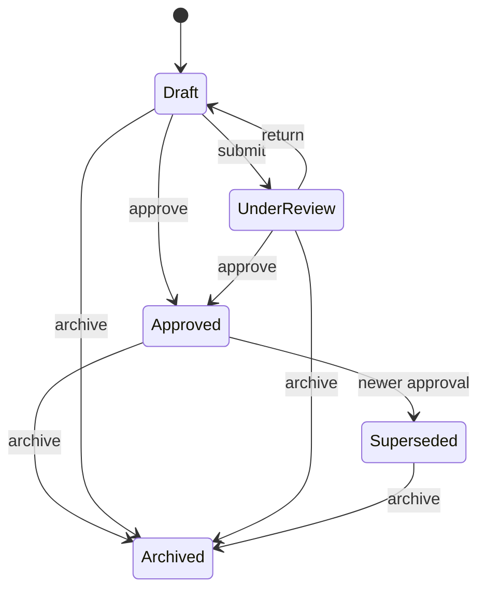

# Risk Assessment

Status: Implemented (TASK-P8-003)

## Purpose

Risk Assessment evaluates hazards in an operational context using configurable
methodology profiles. One hazard may have many assessments (workplace, activity,
equipment, contractor, etc.).

## Aggregate

```text
RiskAssessment
├── id / organization_id / hazard_id / code / title
├── assessment_profile
├── assessed_object (typed reference)
├── assessor / assessment_date
├── review_schedule
├── inherent_risk / residual_risk
├── controls[] (Hierarchy of Controls)
├── acceptance
├── competency_requirements[]
├── extension_references{}
├── status / version / timestamps
```

## Lifecycle



Only one **Approved** assessment may exist for the same
`(hazard, assessed_object, assessment_profile)`. Approving a newer assessment
automatically supersedes the previous approved one.

## Profiles and matrices

Built-in profiles (methodology-neutral catalog): Simple 3×3/5×5, Corporate Custom,
Russian Occupational Risk, Industrial/Fire/Environmental/Transport/ADR.

Profiles define factors, matrix size, acceptable levels, and default review cadence.
Formulas live in the profile service — not inside aggregate methods.

## Inherent vs residual

Inherent risk is stored separately from residual risk. Residual never overwrites
inherent. Controls attach via Hierarchy of Controls types without a full control
lifecycle.

## Russian extension points

`extension_references` and profile codes support future SOUT/OPO/fire/ADR concepts
without embedding legal logic.

## Authorization

| Permission | Admin | Member | Auditor |
|---|---|---|---|
| `risk:read` | yes | yes | yes |
| `risk:create` | yes | yes | no |
| `risk:update` | yes | yes | no |
| `risk:review` | yes | no | no |
| `risk:approve` | yes | no | no |
| `risk:archive` | yes | no | no |

## Audit

`safety.risk.created|updated|approved|superseded|archived`
