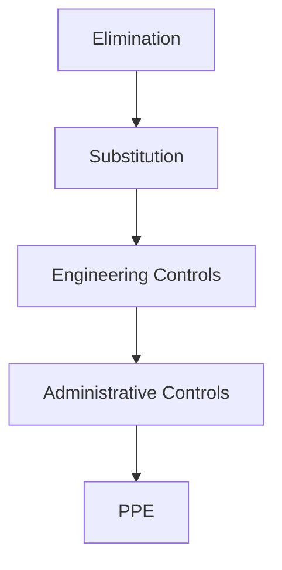
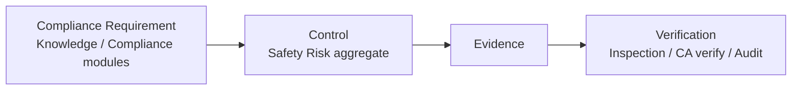
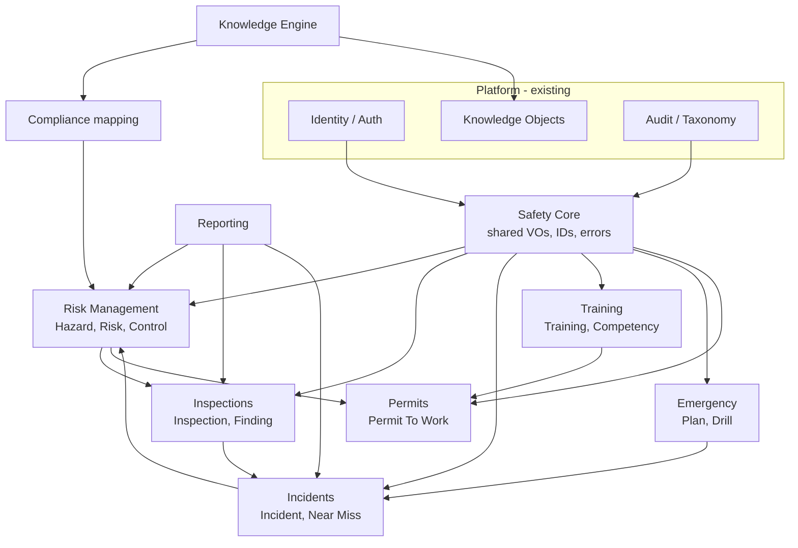

# Safety Domain Foundation

Status: Active  
Date: 2026-07-24  
Task: TASK-P8-001

Related documents:

- [UbiquitousLanguage.md](UbiquitousLanguage.md)
- [Aggregates.md](Aggregates.md)
- [DomainEvents.md](DomainEvents.md)
- [LifecycleRules.md](LifecycleRules.md)
- [ArchitectureConstitution.md](../architecture/ArchitectureConstitution.md)
- [PersistentIdentityStores.md](../architecture/PersistentIdentityStores.md)
- [RoleBasedAuthorization.md](../architecture/RoleBasedAuthorization.md)
- [AdministrativeAuditLog.md](../architecture/AdministrativeAuditLog.md)

---

## 1. Purpose

This document is the entry point for the Occupational Health and Safety business domain
on SafetyMAIN. Phases P1–P7 delivered the technical platform; P8 begins the business
core without shipping end-user CRUD features.

The Safety domain must remain understandable to safety professionals, free of
infrastructure types, and stable enough that Hazards, Risks, Inspections, Incidents,
Training, Permits, Compliance, Knowledge, and AI modules can extend it without redesign.

---

## 2. Layer Placement

| Concern | Layer |
|---------|-------|
| Aggregates, VOs, domain events, repository contracts | `backend/core/domain` |
| Use cases / handlers | `backend/core/application` (future tasks) |
| SQLAlchemy / PostgreSQL | `backend/core/infrastructure` (future tasks) |
| HTTP | `backend/api` (future tasks) |

Domain modules must not import Application, Infrastructure, API, Bootstrap, FastAPI, or
SQLAlchemy. Guardrails enforce this (see §14).

---

## 3. Risk Model (Conceptual)

| Concept | Meaning |
|---------|---------|
| **Inherent risk** | Risk level before controls (or before *additional* controls under assessment). |
| **Residual risk** | Risk level after implemented controls. |
| **Likelihood / Probability** | Chance of the hazardous event occurring. |
| **Severity** | Consequence magnitude if the event occurs. |
| **Risk level** | Derived classification from probability × severity (matrix later). |
| **Reassessment** | Return from Monitoring → Assessed when conditions, incidents, or review dates demand. |
| **Review frequency** | Policy-driven interval stored as metadata; enforcement later |

### Extension points (not implemented)

- Configurable risk matrices per organization
- Quantitative scoring engines
- Automatic residual recalculation rules
- ALARP / risk acceptance workflows beyond status `Accepted`

Algorithms are explicitly out of scope for TASK-P8-001.

---

## 4. Hierarchy of Controls

Ordered from most to least preferred:

| Level | Applicability |
|-------|---------------|
| Elimination | Remove the hazard entirely |
| Substitution | Replace with less hazardous alternative |
| Engineering | Isolate people from the hazard |
| Administrative | Change the way people work |
| PPE | Protect the worker with equipment |

Future rule engines should **prefer higher levels** when recommending controls and may
flag PPE-only treatments for high residual risk. Ordering is encoded in domain VO
`ControlType` / hierarchy rank.

---

## 5. Compliance Connection

- Requirements stay **external** to Safety aggregates.
- Safety maps Controls and Evidence to requirement IDs supplied by Knowledge Engine /
  Compliance modules (future).
- SafetyMAIN does not embed regulatory text inside Risk aggregates.

---

## 6. Tenant Ownership

| Aggregate / concept | Ownership |
|---------------------|-----------|
| Hazard, Risk, Inspection, Incident, CorrectiveAction, Training, Permit, EmergencyPlan, Asset | **Organization-owned** |
| Hierarchy of Controls, severity/probability scales (platform defaults) | **Global catalog** (immutable enums / shared reference) |
| Org-specific category lists | Future org-configurable reference data |
| Compliance Requirement, SDS bodies | Knowledge / shared catalogs — not Safety-owned masters |
| User / Membership | Identity domain (existing) |

Every organization-owned aggregate carries `organization_id` and is subject to existing
tenant isolation rules at the application boundary.

---

## 7. Audit Expectations

Reuse existing audit integrity and taxonomy infrastructure. Future Safety handlers will
record business audits; security-sensitive actions may also emit taxonomy events.

| Aggregate | Audited operations (planned) | Security relevance | Investigation relevance | Metadata (safe) |
|-----------|------------------------------|--------------------|-------------------------|-----------------|
| Hazard | create, activate, archive | Medium | Medium | hazard_id, status, org |
| Risk | assess, accept, control changes | Medium–High | Medium | risk_id, hazard_id, levels |
| Inspection | start, complete, finding add | Medium | Medium | inspection_id, finding_id |
| Incident | report, status, close | **High** | **High** | incident_id, near_miss, severity |
| CorrectiveAction | assign, complete, verify, close | Medium–High | High | action_id, assignee |
| Training | complete | Low–Medium | Low | training_id |
| Permit | issue, close | **High** | High | permit_id, validity |
| EmergencyPlan | activate (ops), publish | **High** | High | plan_id, level |
| Asset | create, decommission | Low | Low | asset_id |

Never place secrets or unbounded medical detail in audit metadata without a future
privacy design.

---

## 8. Preliminary Authorization Matrix

Roles today: `admin`, `member`, `auditor` (platform RBAC). Safety-specific permissions
will be introduced in implementation tasks; this matrix states **intent**.

Legend: R=Read, C=Create, U=Update, D=Delete, A=Approve/Accept, Cl=Close, As=Assign, V=Verify

| Area | Admin | Member | Auditor |
|------|-------|--------|---------|
| Hazards | R C U D | R C U | R |
| Risks | R C U D A | R C U | R |
| Inspections | R C U D Cl | R C U Cl | R |
| Findings | R C U | R C U | R |
| Incidents | R C U D Cl | R C U | R |
| Corrective Actions | R C U As V Cl | R C U As | R |
| Training | R C U | R C U | R |
| Permits | R C U A Cl | R C U | R |
| Emergency | R C U A | R U | R |
| Assets | R C U D | R C U | R |

Delete is generally reserved for Admin and often replaced by Archive in practice.
Approve/Accept (risk acceptance, permit issue) is Admin-leaning; Member may receive
delegated permissions later.

---

## 9. Module Boundaries

### Dependency rules

- **Safety Core** depends on platform identity/audit abstractions only.
- **Risk Management** does not depend on Reporting or UI.
- **Inspections** may reference Risk/Asset IDs; must not own Risk aggregates.
- **Incidents** may reference Hazards and Corrective Actions by ID.
- **Compliance** depends on Knowledge; Safety depends on Compliance **IDs**, not engines.
- **Reporting** may read all Safety modules; Safety modules must not depend on Reporting.
- **No cycles** between Risk ↔ Inspection ↔ Incident at the *module import* level:
  shared types live in Safety Core.

---

## 10. Repository Contracts (Foundation)

Defined under `backend/core/domain/repositories/`:

| Contract | Aggregate |
|----------|-----------|
| `HazardRepositoryContract` | Hazard |
| `RiskRepositoryContract` | Risk |
| `InspectionRepositoryContract` | Inspection |
| `IncidentRepositoryContract` | Incident |
| `TrainingRepositoryContract` | Training |
| `PermitRepositoryContract` | Permit |
| `EmergencyPlanRepositoryContract` | EmergencyPlan |
| `AssetRepositoryContract` | Asset |
| `CorrectiveActionRepositoryContract` | CorrectiveAction |

Contracts return domain entities, hide persistence, participate in Unit of Work, and
contain **no** SQLAlchemy types. Implementations arrive in later tasks.

---

## 11. Value Objects (Foundation Code)

Immutable, self-validating VOs include identifiers, lifecycle statuses, risk dimensions,
`ControlType` (hierarchy), and related classifications. See package
`backend/core/domain/value_objects/` (`safety_*.py` and specific ID modules).

---

## 12. Known Limitations

- No API, migrations, or ORM mappings in this task
- No risk scoring algorithm
- No async domain event bus
- Person masters (Employee/Contractor/Visitor) and Chemical inventory deferred
- Preventive Action may share or split from CorrectiveAction later

---

## 13. Next Implementation Steps

1. TASK for Hazard + Risk write models and APIs  
2. Inspection + Finding  
3. Incident + Corrective Action  
4. Wire permissions and audit actions into taxonomy/admin audit registries  

---

## 14. Guardrails

Executable tests under `tests/architecture/test_p8_safety_domain_guardrails.py` and
existing domain dependency suites prevent infrastructure leakage and document/module
drift for the Safety foundation.
